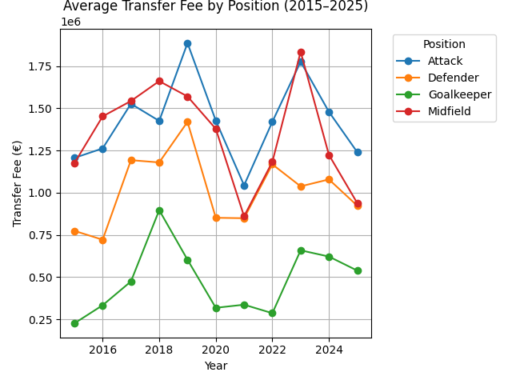

# ⚽ Transfermarkt Data Analysis with PySpark

This project explores football player transfer data from **Transfermarkt** using the **Bronze–Silver–Gold architecture** with **PySpark** for scalable data processing and **Matplotlib/Seaborn** for visual insights.

The goal was to uncover patterns in player transfers, evaluate positional trends, and explore club spending vs. success dynamics over the last 10 years.

> _Further analysis may be added in the future by combining this dataset with additional sources such as player performance metrics, team rankings, or financial data, to explore deeper insights into transfer efficiency and sporting success._
---

## 🗂 Project Structure

- 📁 **data/**  
  Raw CSVs: `players.csv`, `transfers.csv`

- 📁 **notebooks/**  
  Bronze, Silver, and Gold processing scripts (PySpark)

- 📁 **figures/**  
  All visualizations generated in the analysis

---

## 🔍 Dataset Source

- 📦 **Source**: [Kaggle – Transfermarkt Data](https://www.kaggle.com/datasets/josephvm/transfermarkt-data)   
- 🕒 **Time Frame**: Filtered to last 10 years (2015–2025)

---

## ⚙️ Technologies Used

- PySpark for distributed data processing   
- Pandas & Matplotlib & Seaborn for plotting  
- Project structure inspired by Medallion (Bronze/Silver/Gold)
  
---
## 📊 Key Insights & Visual Findings

According to the data from the past decade, goalkeepers consistently have the lowest average transfer fees among all positions. Defenders also tend to be transferred for relatively lower amounts compared to midfielders and attackers.

While the graph presents the average transfer fee per position, it’s important to note that the number of goalkeeper transfers is significantly smaller than that of outfield players. This limited sample size can lead to greater fluctuations in the average values for goalkeepers, potentially skewing interpretations.

Notable spikes in average transfer fees during **2018 and 2023 may be linked to the FIFA World Cup tournaments held in 2018 (Russia) and late 2022 (Qatar)**. These global events often boost player visibility, leading to increased market demand and higher valuations in the subsequent transfer windows.

Interestingly, goalkeeper transfer trends appear more stable, whereas attackers and midfielders show more volatility in fees—likely driven by shifting market dynamics and the influence of high-profile stars.

Overall, the data suggests that offensive roles are more highly valued in the transfer market, while defensive and goalkeeping positions attract comparatively less financial investment.

The chart reveals a relatively normal distribution of average transfer fees by age for each position. Most positions peak around the 24–27 age range, which aligns with the commonly accepted peak performance age in professional football.

However, a few notable insights emerge:

- Goalkeepers tend to maintain or even increase their transfer value well into their late 20s and early 30s. This is likely because goalkeeping relies more on reflexes, positioning, and decision-making than on stamina or explosive speed.

- Attackers also show a broader age range with sustained high transfer fees, possibly due to the premium placed on goal-scoring ability and individual flair — attributes that can persist despite some decline in physical capacity.

These trends suggest that positions requiring less continuous physical exertion and more tactical awareness (e.g., goalkeepers and some attackers) may be more resilient to age-related declines. Their roles allow them to retain high market value even as their physical peak passes.

